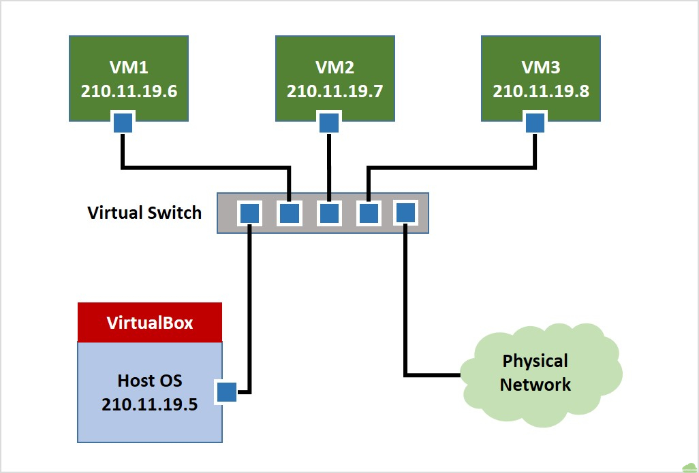
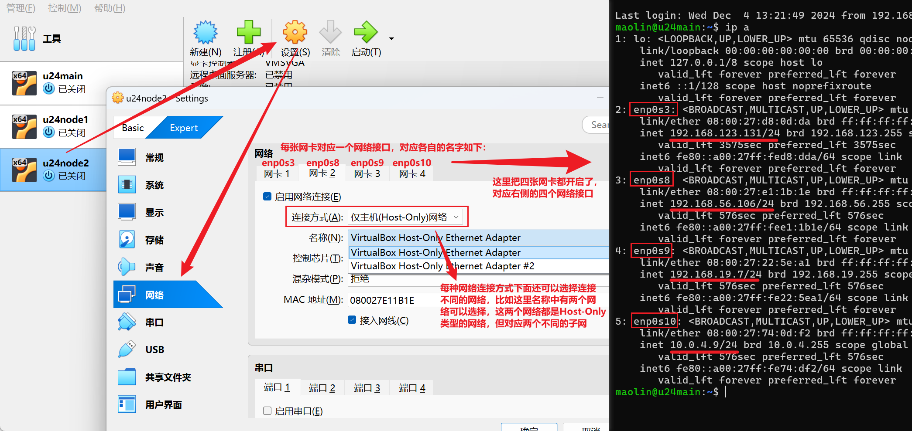
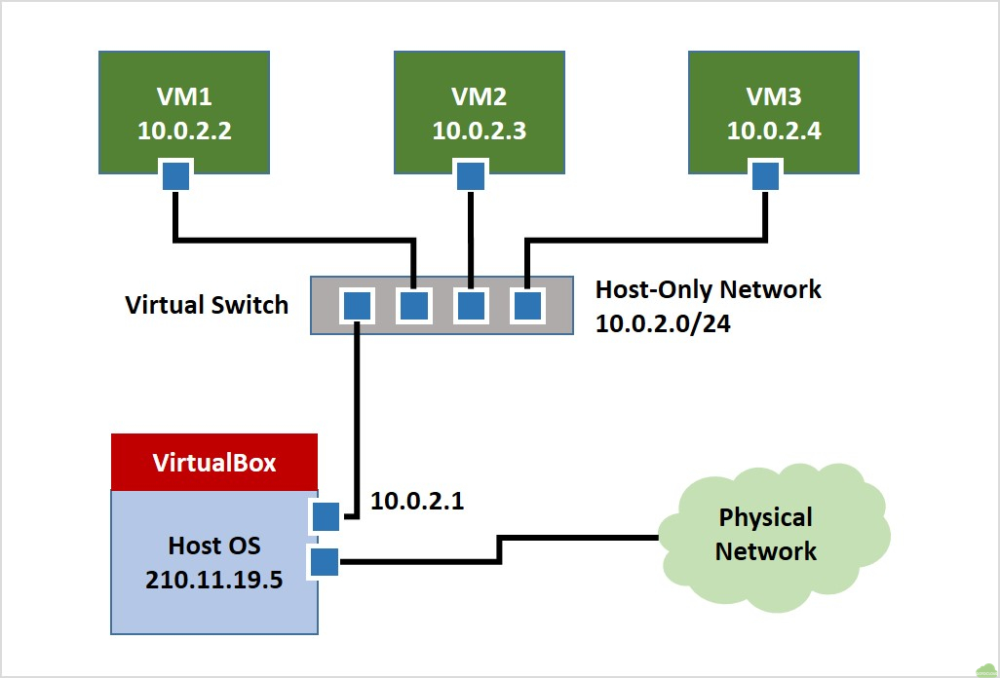
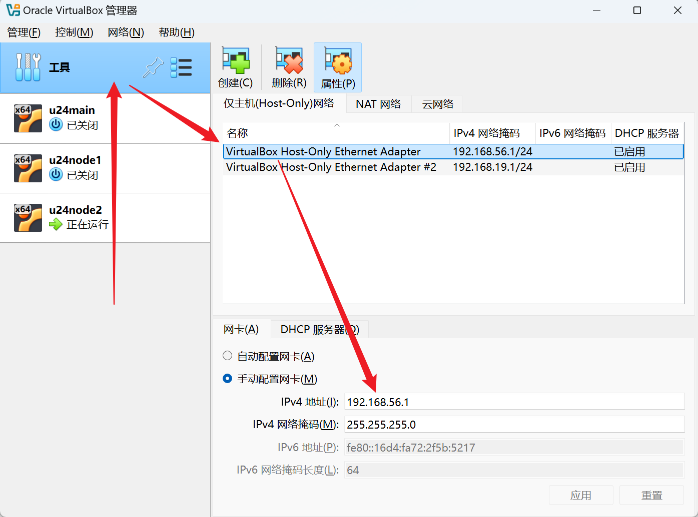
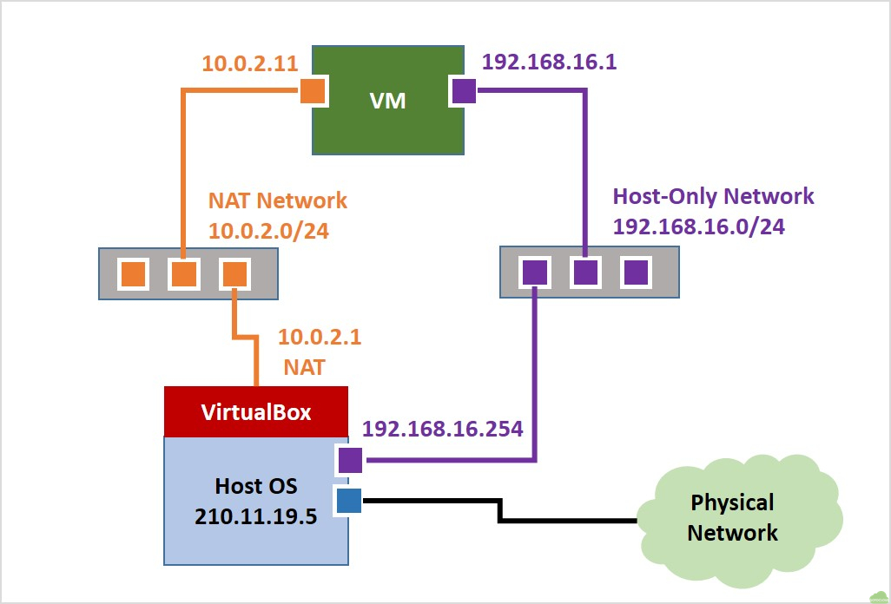
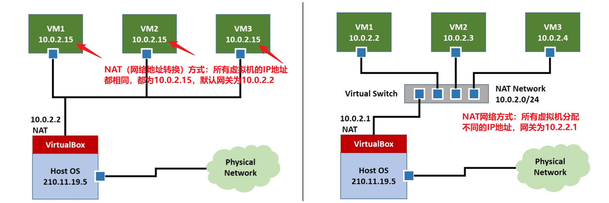

## 网络踩坑过程

我最开始的想法很简单，搭建三个虚拟机，虚拟机之间可以相互通信，可以访问网络，同时主机也可以通过ssh连接上这几台虚拟机，因为DHCP会随机分配地址，所以最好能设置静态IP。

### 一、不稳定的连接——桥接网络

网桥的方式可以将所有虚拟机和主机连接到同一个子网中，virtualbox会虚拟出一个网桥，其逻辑效果如下：



这很契合我的需求，在同一个子网中，各个虚拟机之间、以及虚拟机和主机之间可以相互通信，因此我沿着这个思路来设置网络。

为便于连接，我通过netplan配置文件关闭DHCP，并设置对应网卡的静态IP地址和网关，到目前为止，一切正常，我在主机上通过ssh顺利连接上了虚拟机。

但是晚上的时候我刚好需要把笔记本从实验室带回宿舍，当笔记本重新连接WiFi时，主机所在的子网发生了变化，路由器也由此改变，而我原先设定的静态IP并不会根据WiFi变化而改变，导致所有虚拟机的IP地址在新的网络中失效，他们依然拥有原先的IP地址，但这些地址和主机不在一个网络中，主机不再能通过ssh连接上他们。

这就是动态网络下静态IP地址面临的问题。

### 二、主机与虚拟机的稳定连接——网桥+Host-Only

既然网桥下的方式中虚拟机的IP地址会随网络环境而变化，那搭配一个不随网络环境改变的Host-Only网卡，这样主机就能保持和虚拟机的正常连接了吧。



VirtualBox支持每个虚拟机可以创建四个网络接口，不同的网络接口所在的网络是不同的，当设置好Host-Only网络后，虚拟机会分配一个新的IP地址，这个IP地址属于Host-Only子网，是不同于桥接网络的另一个子网。其逻辑如下：



在Host-Only中，主机和所有虚拟机构成一个局域网，主机和其他虚拟机没有什么不同，当虚拟机发出网络数据包后，这个数据包会通过Virtual Switch到达主机和其他虚拟机，当机器接受到这个数据包后，比对数据包中的目标MAC地址和自身地址是否一致，不一致则丢弃。

> 由于主机在Host-Only子网中并不承担转发功能，所以它收到目标MAC地址和自身不一致的包后就直接丢弃。而如果是路由器，它会逐步拆解这个包得到IP头部的目标IP地址，再根据路由表进行转发。
>
> 另外，交换机（Switch）或网桥中也维护了一张记录表，它们工作在数据链路层（第二层），记录了每个MAC地址应该发往那个出口，这张表最初是空的，此时Switch会将接受到的每个数据包进行广播，慢慢的这个记录表越来越完善，Switch就会根据表进行转发，从而减少数据广播。

**外界网络环境的变化对Host-Only子网完全没有影响，它只会因用户手动修改而改变**，因此当我为Host-Only网卡设置了静态IP地址后，主机可以稳定的通过这个静态IP地址和虚拟机进行通信。比如下面设定的网络中，其网络始终保持为192.168.56.0/24。



但是！当WiFi改变时，虚拟机在桥接网络中的IP地址却并没有自动进行更新，导致虚拟机不再能访问互联网，我需要通过手动触发DHCP来重新获得IP地址。方式如下：

```bash
sudo apt install isc-dhcp-client isc-dhcp-client-ddns	# 安装dhcp管理工具
sudo dhclient -r  # 删除原有IP地址
sudo dhclient     # 通过DHCP重新分配
```

所以Host-Only网络只解决了虚拟机和虚拟机之间、主机和虚拟机之间稳定通信的问题，但并没有解决虚拟机和互联网之间稳定通信的问题。

> 我的环境是 VirtualBox 7.1.4，虚拟机为 Ubuntu Server 24.04，GPT说可以通过网络管理服务自动进行网络更新：
>
> ```bash
> sudo apt install network-manager
> sudo systemctl enable NetworkManager
> sudo systemctl start NetworkManager
> sudo systemctl status NetworkManager
> ```
>
> 但我实践后虚拟机并没有通过DHCP自动更新IP地址。


### 三、终极解决方案——NAT网络+Host-Only

最后要解决的是虚拟机和互联网之间稳定通信的问题。这可以通过NAT网络来解决。

在 NAT 模式下，VirtualBox 会模拟一个 NAT 路由器，虚拟机通过该路由器与外部网络通信。虚拟机发送的数据包会经过 NAT 路由器，源 IP 地址被替换为路由器的主机 IP 地址，并分配特定的端口号。当返回的数据包到达时，NAT 路由器根据记录的映射关系，将数据包转发回对应的虚拟机。由于 NAT 路由器是由 VirtualBox 虚拟的网络设备，虚拟机和主机并不在同一个网络中。因此，虚拟机可以通过 NAT 模式访问外部网络，但主机无法直接访问虚拟机，除非进行额外的配置，如端口转发。

> 传统NAT的转换表是不包含端口号的，记录端口号的NAT被称为NAPT（Network Address Port Translation），在VirtualBox中提供的是NAT方式。
>
> NAT和路由器的区别：路由器的主要职责是根据路由表将数据包从一个网络转发到另一个网络，而不修改数据包的 IP 地址信息；而 NAT 的主要功能是在数据包通过路由器时，修改其 IP 地址信息，实现内部网络与外部网络的通信。
>
> 在这个过程中，NAT对外隐藏了内部网络，因为只有内部网络数据主动向外转发时才会记录地址转换规则，外部网络只能被动回复，没有办法主动建立连接，因为没有对应的转换规则。



在这个网络中，NAT网络是由用户来指定的，外部网络变化时，只有NAT路由器上的主机IP地址会改变，但并不影响内部的NAT网络，所以通过NAT网络可以和外部取得稳定的通信。


### 踩坑：在VirtualBox7.1.4版本中，NAT网络失效

VirtualBox提供了两种NAT方式：NAT（网络地址转换）和NAT网络。

前者是VitualBox预先创建好的网络，它为所有虚拟机分配相同的IP地址，虚拟机之间不能相互通信；

后者需要手动通过“工具>网络管理器>NAT网络>创建”进行创建。这个网络中不同的虚拟机会分配到不同的IP地址，使得虚拟机之间也可以相互通信。示意图如下：[VirtualBox 网络拓扑 – GotoCloud --- VirtualBox Network Topology – GotoCloud](https://gotocloud.co.kr/?p=2304)



最初我采用的是第一种方式，但尝试了很久，都不能正常通信，一度以为是我个人的操作问题，直到我在VirtualBox论坛上看到了相关的帖子：[VirtualBox 升级到 7.1.0 后，IPV4 NAT 在 Windows 11 客户机下无法工作-virtualbox.org ]([IPV4 NAT not working under Windows 11 guest after VirtualBox upgrade to 7.1.0 - Page 2 - virtualbox.org](https://forums.virtualbox.org/viewtopic.php?t=112323&start=15&sid=a45229a3fa177b06af8174c38543aa1e))

> 经尝试发现在旧的7.0.22版本中，NAT是可以正常工作的，推荐下载该版本。[Download_Old_Builds_7_0](https://www.virtualbox.org/wiki/Download_Old_Builds_7_0)

不过在我的实验中，第二种方式依然是有效的，所以我们可以手动创建一个NAT网络，让虚拟机通过该网络与外界进行通信。


