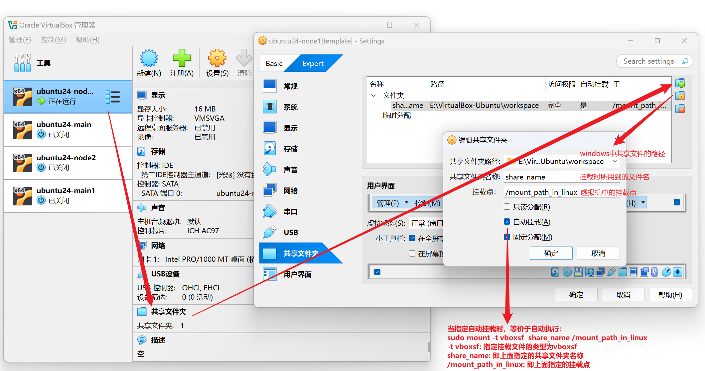

### 文件共享

首先需要在ubuntu中安装所需的工具：

```bash
sudo apt update
sudo apt install virtualbox-guest-utils
```

随后进行配置共享文件即可：



当指定自动挂载时，等价于virtualbox帮我们自动执行`sudo mount -t vboxsf  share_name /mount_path_in_linux`

`-t vboxsf`: 指定挂载文件的类型为vboxsf

`share_name`: 即上面指定的共享文件夹名称

`/mount_path_in_linux`: 即上面指定的挂载点

随后便可以在 `/mount_path_in_linux` 中访问到共享文件。

> 如果没有成功挂载，可能是没有安装virtualbox-guest-utils，执行`sudo apt install virtualbox-guest-utils`进行安装即可。
>
> 也可以手动执行`sudo mount -t vboxsf  share_name /mount_path_in_linux` 进行挂载，都是一样的。
>
> 此外，挂载成功后执行mount最后一行会看到：
>
> ```bash
> ~$ mount
> sysfs on /sys type sysfs (rw,nosuid,nodev,noexec,relatime)
> proc on /proc type proc (rw,nosuid,nodev,noexec,relatime)
> ...
> share_name on /mount_path_in_linux type vboxsf (rw,nodev,relatime)
> ```

### 踩坑：共享文件的所在用户和组

早前的版本中共享文件的所属用户和组分别是root和vboxsf，可以通过 `sudo usermod -aG vboxsf your_username` 将用户加入到 `vboxsf` 组从而获得访问和修改权限。

但在我使用的7.1.4版本的virtualbox中，通过`ls -l /mount_path_in_linux` 看到共享文件的所属用户和组都是 `root`，这意味着需要将普通用户加入到root组才能访问和修改共享文件，这并不是一种推荐的做法。

virtualbox的最新版本为7.1.4，7.1.0~7.1.4版本似乎都不太完善，因此并不推荐使用最新的这几个版本。

