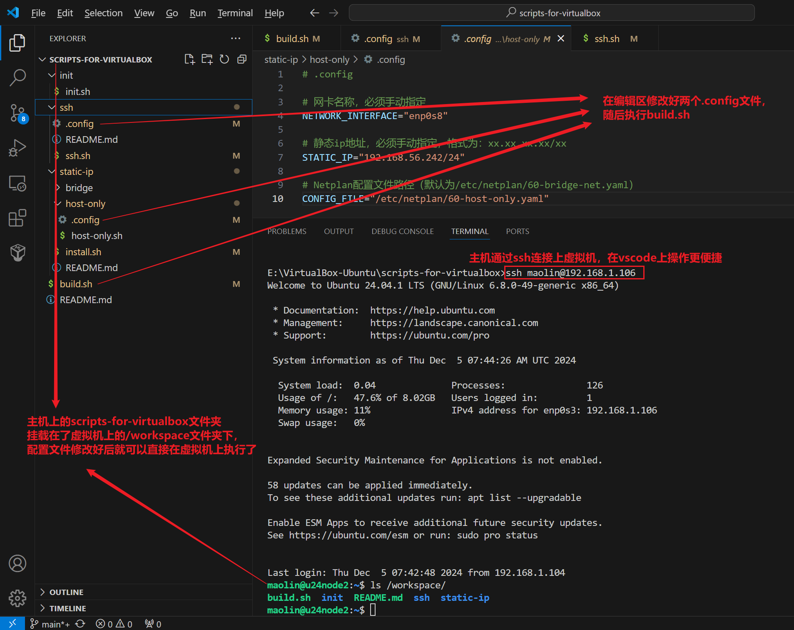

### 1、切换连接方式为 桥接+Host-Only

在创建虚拟机时VirtualBox只提供一个NAT网卡，我们只能在VirtualBox提供的界面进行操作，很不方便。推荐安装好系统后先关机，重新配置网络，比如桥接+Host-Only的方式进行通信，方便主机使用ssh进行连接，在脚本执行完后，再换成NAT+Host-Only的通信方式。

> 踩坑：在安装好系统后添加额外的网卡时，这些网卡并不会自动分配IP地址，比如上面新增的Host-Only网卡并没有对应的IP地址，所以还是需要通过桥接网络和主机进行通信。但我们可以后面通过 `sudo dhclient`手动出发DHCP为Host-Only网卡进行IP地址分配。

### 2、使用GIT下载脚本到主机，并与虚拟机共享文件夹

在主机侧通过桥接网络与虚拟机进行通信，通过 `sudo apt install virtualbox-guest-utils`启动文件共享功能。

使用Git将脚本下载到主机中，随后通过共享文件的方式将该文件挂载到虚拟机上，修改好.config文件后执行build.sh文件。




### 踩坑——cp复制命令

注意 `cp -r /workspace/dir1 /usr/local/dir2` 的行为差异，**当`dir2`文件夹存在时，这个命令会将 `dir1` 作为子文件放在 `dir2` 文件夹下作为子文件夹；当 `dir2` 不存在时，该命令会将 `dir1` 复制到 `/usr/local` 下并重命名为 `dir2` 。**验证过程如下：

```bash
userxx@ubuntu:~$ ls  # 当前目录下只有scripts这个文件夹
scripts
userxx@ubuntu:~$ ls scripts/  # scripts文件夹中的目录如下
bridge-net.sh  temp.py
userxx@ubuntu:~$ cp -r scripts work  # 此时work还不存在，cp会复制scripts并将其重新命名为work
userxx@ubuntu:~$ ls work/  # 复制后得到work文件夹，其中的内容和scripts一致
bridge-net.sh  temp.py
userxx@ubuntu:~$ cp -r scripts work  # 再次重复先前的操作
userxx@ubuntu:~$ ls work/  # 再次查看会发现work文件夹下多了scripts文件夹
bridge-net.sh  scripts  temp.py
```

另外， `cp -r /workspace/dir1/* /usr/local/dir2` 会把dir1目录下的文件复制到dir2文件夹下。**但是，dir1/*不能匹配`.`开头的文件，例如 `.config`**，这些该死的细节花了我很时间进行查错！！！

如果想将文件夹 `/workspace/dir1` 中的所有文件全部放入 `/usr/local/dir2` 中，可以将dir2文件夹删除再复制，即：

````shell
rm -r /usr/local/dir2
cp -r /workspace/dir1 /usr/local/dir2
````

除了共享文件的方式，还可以直接通过VScode连接上虚拟机，并打开虚拟机上的一个文件夹，然后从Windows上把脚本文件拖拽复制过去。这个方法不需要预先安装 `virtualbox-guest-utils` ，简单省事，也是更加推荐的方式。
